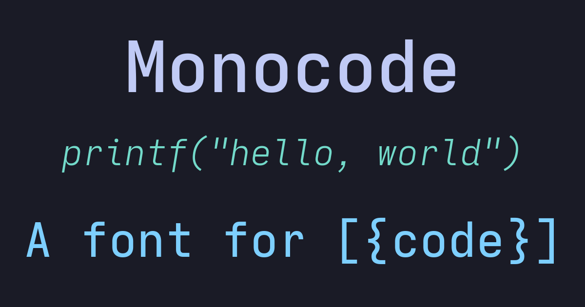
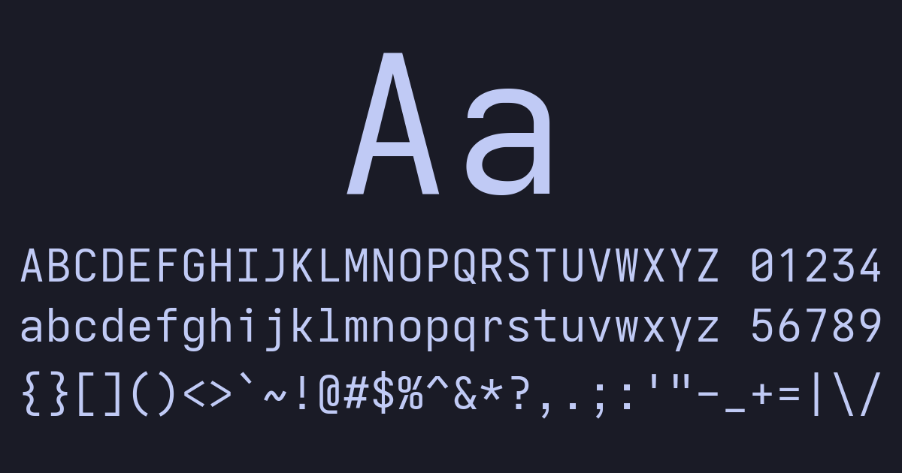
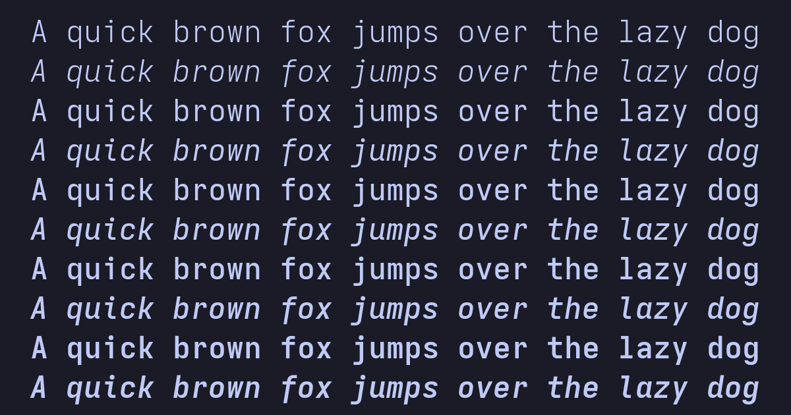
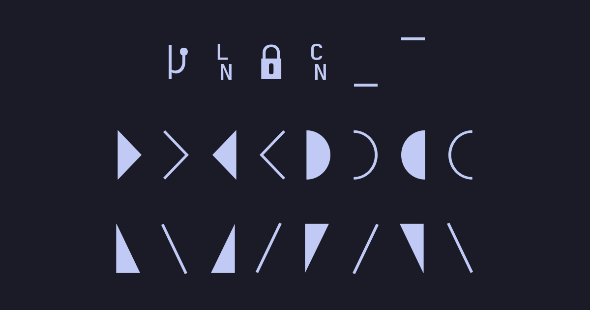
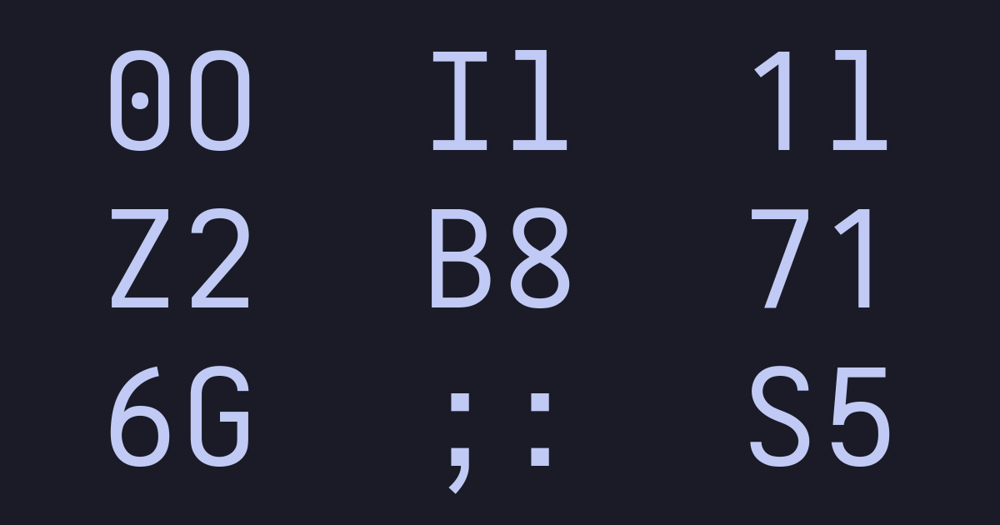

# Monocode

Monocode is a font derived from a customized version of [Iosevka](https://github.com/be5invis/Iosevka). Inpired heavily by [JetBrains Mono](https://www.jetbrains.com/lp/mono/), [Hack](https://sourcefoundry.org/hack/), [Source Code Pro](https://adobe-fonts.github.io/source-code-pro/), and [Input Mono](https://input.djr.com/) with some of my own personal style.

## Installation

1. Download your font package from [releases](https://github.com/aaronmbos/monocode/releases).
2. Quit all your editors / programs.
3. Unarchive the font package and you will see the font files.
4. Take actions depending on your OS:
   - **Windows**: Select the font files and drag into font [settings](ms-settings:fonts) / font control panel page.
     - On Windows 10 1809 or newer, the default font installation is per-user, and it may cause compatibility issues for some applications, mostly written in Java. To cope with this, right click and select “Install for all users” instead. [Ref.](https://youtrack.jetbrains.com/issue/JRE-1166?p=IDEA-200145)
   - **macOS**: [Follow instructions here](http://support.apple.com/kb/HT2509).
   - **Linux** : Copy the font files to your fonts directory then run `sudo fc-cache`.

## Specimen

## Five Weights

Monocode comes in five different weights ranging from Light to Bold for both Regular and Italic styles.

## Powerline Characters

Monocode comes built with the glyphs required for Powerline shell prompts

## Distinct Characters

Monocode distinguishes characters that are prone to legibility issues like capital O and zero.

