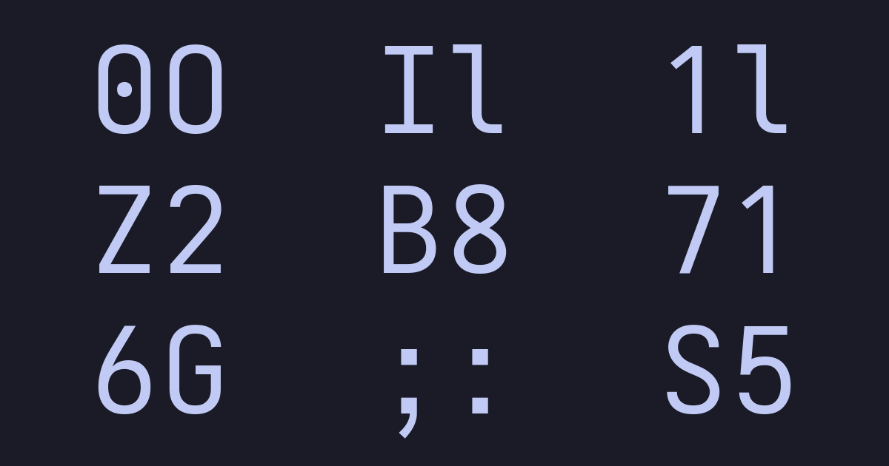

# Monocode

Monocode is a font derived from a customized version of [Iosevka](https://github.com/be5invis/Iosevka). Inpired heavily by [JetBrains Mono](https://www.jetbrains.com/lp/mono/), [Hack](https://sourcefoundry.org/hack/), [Source Code Pro](https://adobe-fonts.github.io/source-code-pro/), and [Input Mono](https://input.djr.com/) with some of my own personal style.

## Specimen

## Five Weights

Monocode comes in five different weights ranging from Light to Bold for both Regular and Italic styles.

## Powerline Characters

Monocode comes built with the glyphs required for Powerline shell prompts

## Distinct Characters

Monocode distinguishes characters that are prone to legibility issues like capital O and zero.

